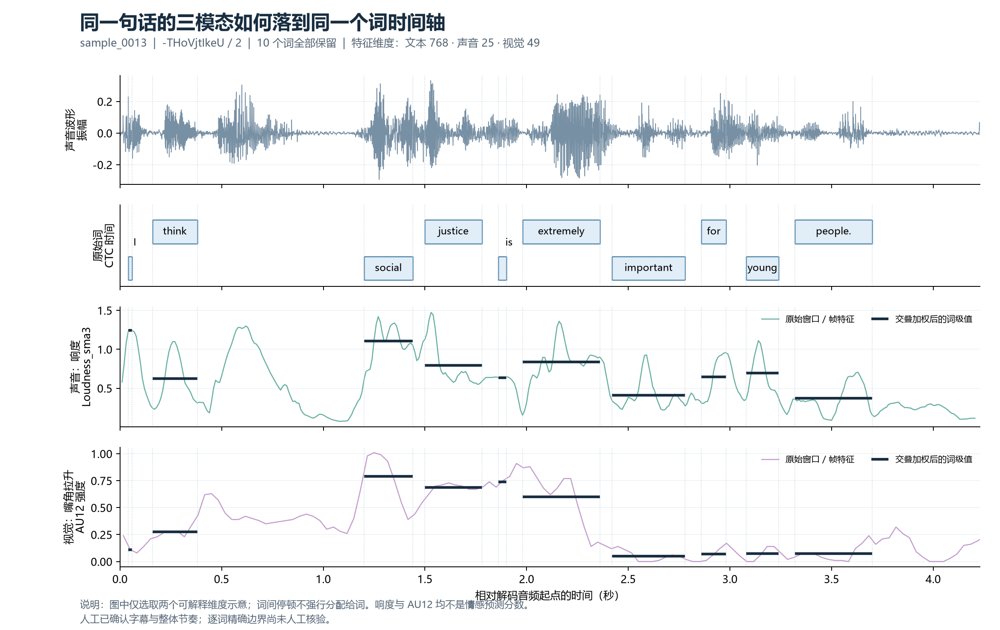

# 问题一典型样本验证

样本 `sample_0013`，原视频标识 `-THoVjtIkeU/2`。

> I think social justice is extremely important for young people.

本例重新从已保存的 BERT token 向量、声音窗口和 OpenFace 帧特征计算词级向量，检查它们与全量合并文件一致。该检查验证映射和数值计算，不能衡量词边界是否等于人工真值。

## 逐词对应关系

表中行号从 1 开始，不计 CSV 表头。BERT token 位置从 0 开始，包含序列特殊 token 的位置；特殊 token 本身不参与词向量平均。声音窗口彼此可重叠，窗口数不同于互不重叠的采样数。

| 原词 | 自动区间 / 秒 | BERT token 位置 | 声音窗口行号（数量） | 视觉帧号（数量） | 声音 / 视觉覆盖率 |
|---|---|---|---|---|---|
| I | 0.040–0.060 | 1 | 4–6（3） | 2–2（1） | 100% / 100% |
| think | 0.160–0.380 | 2 | 16–38（23） | 5–12（8） | 100% / 100% |
| social | 1.200–1.440 | 3 | 120–144（25） | 37–44（8） | 100% / 100% |
| justice | 1.500–1.780 | 4 | 150–178（29） | 46–54（9） | 100% / 100% |
| is | 1.860–1.900 | 5 | 186–190（5） | 56–57（2） | 100% / 100% |
| extremely | 1.980–2.360 | 6 | 198–236（39） | 60–71（12） | 100% / 100% |
| important | 2.420–2.780 | 7 | 242–278（37） | 73–84（12） | 100% / 100% |
| for | 2.860–2.980 | 8 | 286–298（13） | 86–90（5） | 100% / 100% |
| young | 3.080–3.240 | 9 | 308–324（17） | 93–98（6） | 100% / 100% |
| people. | 3.320–3.700 | 10, 11 | 332–370（39） | 100–111（12） | 100% / 100% |

## 以 social 为例

`social` 是原文第 3 个词，字符区间 `[8,14)`，自动时间为 `[1.200,1.440)` 秒。它映射到 BERT token 位置 [3]、词表 ID [2591]，得到一个 768 维上下文向量；同一时间区间内的 25 个声音窗口汇聚为 25 维向量，8 帧视觉汇聚为 49 维向量。

| 视频帧号 | 共同时间轴上的帧区间 / 秒 | 对 social 的归一化权重 |
|---|---|---|
| 37 | 1.200000–1.233333 | 0.138887 |
| 38 | 1.233333–1.266667 | 0.138892 |
| 39 | 1.266667–1.300000 | 0.138887 |
| 40 | 1.300000–1.333333 | 0.138887 |
| 41 | 1.333333–1.366667 | 0.138892 |
| 42 | 1.366667–1.400000 | 0.138887 |
| 43 | 1.400000–1.433333 | 0.138887 |
| 44 | 1.433333–1.466667 | 0.027779 |

每帧的贡献取决于它与词区间交叠的时长，边界帧只贡献相交部分。同一词的有效权重和为 1。全量权重及声音窗口行号保存在配套 JSON，可回溯所有参与汇聚的观测。

## 数值验证与人工检查范围

| 重算项目 | 最大绝对误差 |
|---|---|
| audio | 0.000121875 |
| vision | 1.3361545e-05 |
| text | 0 |

数值比较采用浮点容差：文本 `rtol=1e-5, atol=1e-6`，声音/视觉 `rtol=2e-5, atol=2e-5`；权重另与区间交叠公式重算结果比较。10 个词均有有效三模态特征，声音与视觉覆盖率均为 100%。

用户先前已听音确认转写及整体停顿、语序、语速相符；人工记录明确写明 `exact_word_boundaries=not_manually_verified`。因此，本例只能支持“端到端映射可追溯、数值重算一致、整体节奏经听音确认”，不能支持“所有词边界精确无误”。

## 复现与来源

运行 `src/2026-09-24_build-q1-example_v1.0.py` 可重建本报告、图及 JSON；不调用模型、不改动原始特征。来源文件 SHA-256 保存在配套 JSON 中。

- `mosei-multimodal-aligned-v1.0/sample_0013.npz`
- `mosei-text-bert-v1.0/sample_0013.npz`
- `mosei-audio-egemaps-v1.0/sample_0013.csv`
- `mosei-openface-pilot-v1.0/sample_0013.csv`
- `mosei-audio-v1.0/sample_0013.wav`
- `pilot-sample/2026-09-23_pilot-qc_v1.0.json`
